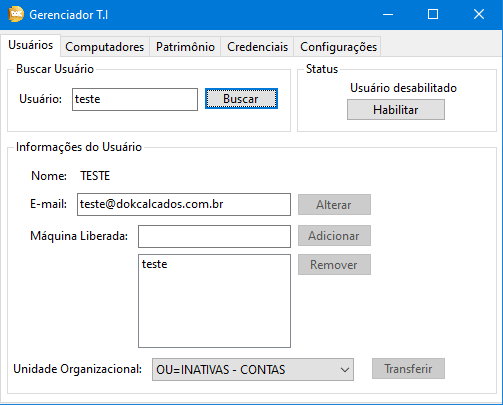
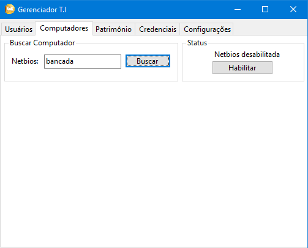
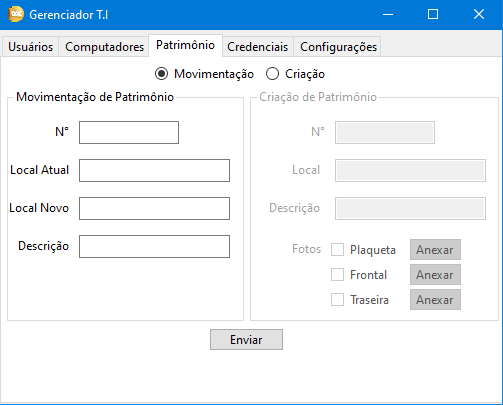
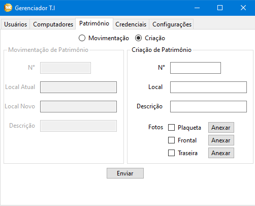
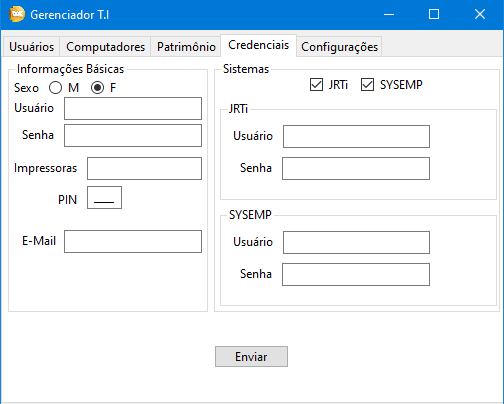
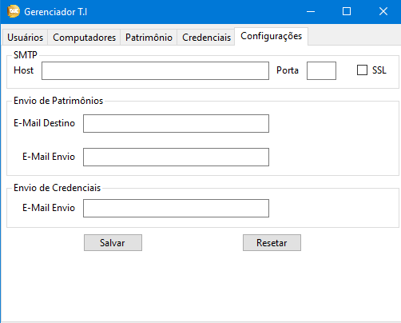

# GerenciadorTI

Este projeto é a última versão melhorada do meu outro projeto [Ferramentas T.I](https://github.com/Marchinner/FerramentasTI). 
Esta versão foi desenvolvida em C# com o intúito de otimizar a velocidade de execução do programa, suas
funções e também colocar em prática conhecimentos obtidos enquanto eu estava estudando C# e seus usos.

As diferenças mais marcantes deste projeto para o outro são:
- Implementação e busca de informações totalmente automatizada, sem a necessidade de inserir informações privadas no código do programa.
- Funcionamento em qualquer computador com acesso Administrativo a um Active Directory.
- Arquivo de configurações em XML para envio de e-mails.

## Screenshots

## Funcionalidades
- Buscar e editar informações do usuário, mover, ativar, alterar e-mail e computador liberado para logon
- Buscar e habilitar/desabilitar computadores da rede
- Enviar uma mensagem automática conforme o formulário para informar a movimentação de um item de patrimônio
- Enviar uma mensagem automática para um novo item de patrimônio e anexar as fotos necessárias para cadastro
- Enviar uma mensagem automática de "boas vindas" que informa ao novo colaborador sobre suas credenciais e acessos

## Tecnologias
- C#
- Windows Forms
- DirectoryServices
- Net.Mail
